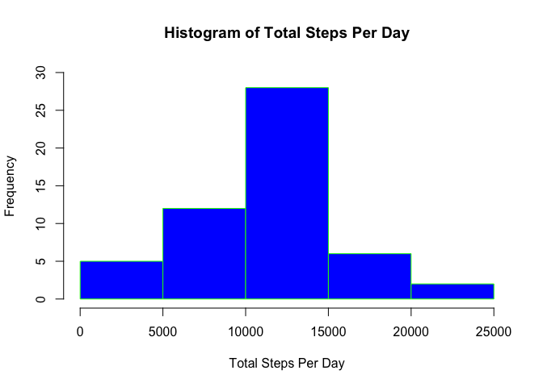
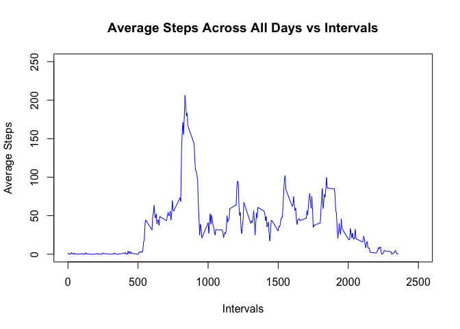
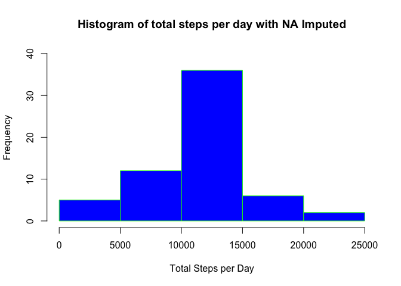
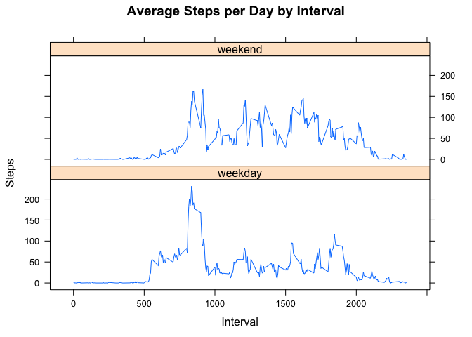

# Reproducible Research: Peer Assessment 1

This report answers questions related to the peronsal movement activities captured in data set, "activity.csv" file. The report was created in single R markdown document that was processed by knitr and transformed into an HTML file.


## Loading and preprocessing the data
Reading "activity.csv" and removing NAs

```r
activity_df <- read.csv("activity.csv")
activity_df_noNA <- activity_df[!is.na(activity_df$steps),]
```
## What is mean total number of steps taken per day?
Below is the histogram of total steps per day with Mean and Median of total steps per day

```r
activity_df_daily <- aggregate(steps ~ date, activity_df_noNA, sum)
hist(activity_df_daily$steps, main="Histogram of Total Steps Per Day", xlab="Total Steps Per Day", ylim=c(0,30), col="blue", border="green")
```

<!-- -->


Mean of total steps per day

```r
round(mean(activity_df_daily$steps))
```

```
## [1] 10766
```


Median of total steps per day

```r
round(median(activity_df_daily$steps))
```

```
## [1] 10765
```
## What is the average daily activity pattern?
Below is time series plot (i.e. type = "l") of the 5-minute interval (x-axis) and the average number of steps taken, averaged across all days (y-axis)

```r
activity_df_interval <- aggregate(steps ~ interval, activity_df_noNA, mean)
plot(activity_df_interval$interval,activity_df_interval$steps, xlab="Intervals", ylab="Average Steps", type="l", col="blue",xlim=c(0,2500), ylim=c(0,250), main="Average Steps Across All Days vs Intervals")
```

<!-- -->


The interval with maximum number of steps

```r
activity_df_interval[which.max(activity_df_interval$steps),]
```

```
##     interval    steps
## 104      835 206.1698
```

##Imputing missing values
Replacing NAs with average 5-minute interval and plotting a histogram of total steps taken each day on the imputed dataset


The Total, Mean and Median steps are higher after the replacement of NAs with values from average 5-minute interval values

```r
paste("The number of NA rows is",nrow(activity_df[is.na(activity_df$steps),]))
```

```
## [1] "The number of NA rows is 2304"
```

```r
imputeNA <- function(steps, interval) {
        if (is.na(steps))
         imputed <- (activity_df_interval[activity_df_interval$interval == interval, "steps"]) else imputed <- c(steps)
    return(imputed)
}
activity_df_imputed <- activity_df
activity_df_imputed$steps <- mapply(imputeNA, activity_df$steps, activity_df$interval)
#histogram of total steps taken each day
activity_df_daily <- aggregate(steps ~ date, activity_df_imputed, sum)
hist(activity_df_daily$steps, main="Histogram of total steps per day with NA Imputed", xlab="Total Steps per Day", ylim=c(0,40), col="blue", border="green")
```

<!-- -->


Mean total steps per day

```r
round(mean(activity_df_daily$steps))
```

```
## [1] 10766
```


Median total steps per day

```r
round(median(activity_df_daily$steps))
```

```
## [1] 10766
```
## Are there differences in activity patterns between weekdays and weekends?
Based on the plot for weekend and weekdays over the average 5-minute intervals, the weekend seems to be more active overall. However, the peak activity interval happens to be on weekday

```r
activity_df_imputed$day <- weekdays(as.Date(activity_df_imputed$date))
activity_df_imputed$day <- ifelse(activity_df_imputed$day %in% c("Monday", "Tuesday", "Wednesday", "Thursday", "Friday"), "weekday", "weekend")
activity_df_interval <- aggregate(steps ~ interval+day, activity_df_imputed, mean)
#plotting
library(lattice)
activity_df_imputed$day <- as.factor(activity_df_imputed$day)
xyplot(activity_df_interval$steps ~ activity_df_interval$interval|activity_df_interval$day, main="Average Steps per Day by Interval",xlab="Interval", ylab="Steps",layout=c(1,2), type="l")
```

<!-- -->


The peak activity interval occurs during a weekday

```r
activity_df_interval[which.max(activity_df_interval$steps),]
```

```
##     interval     day    steps
## 104      835 weekday 230.3782
```
